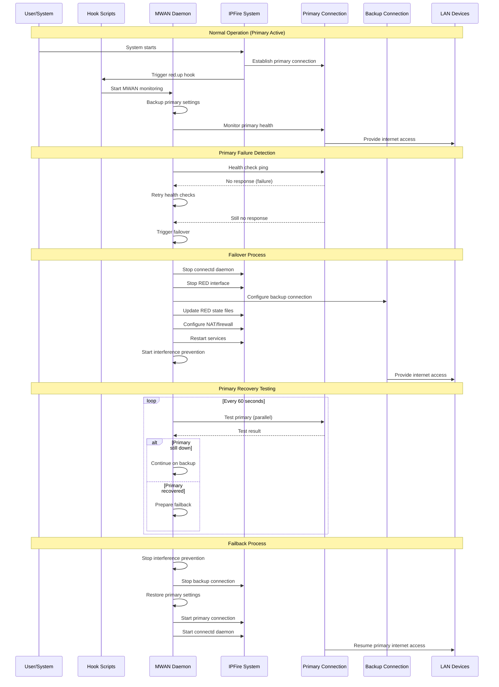
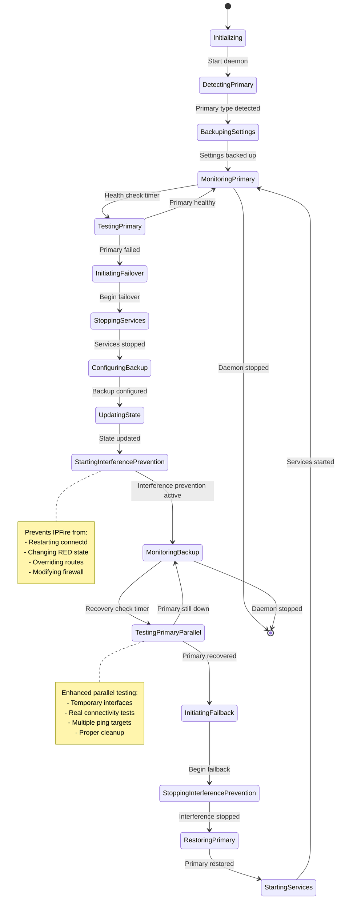

# Universal MWAN Architecture Overview

## 1. System Overview Diagram

```mermaid
graph TB
    subgraph "Internet"
        I1[Primary ISP]
        I2[Backup ISP]
    end
    
    subgraph "Physical Layer"
        P1[Primary Interface<br/>eth0/ppp0/qmi0]
        P2[Backup Interface<br/>eth1/usb0]
    end
    
    subgraph "IPFire System"
        subgraph "Original IPFire"
            RED[RED Interface Manager<br/>/etc/init.d/networking/red]
            CONN[connectd Daemon<br/>/etc/init.d/connectd]
            FW[Firewall<br/>iptables]
            DNS[DNS Services<br/>unbound]
        end
        
        subgraph "MWAN System"
            MWAN[MWAN Daemon<br/>/usr/local/bin/mwan-daemon-universal]
            CONFIG[MWAN Config<br/>/usr/local/bin/mwan-config]
            HOOKS[Hook Scripts<br/>/etc/init.d/networking/red.up/down]
        end
        
        subgraph "State Management"
            STATE[State Directory<br/>/var/ipfire/mwan/state/]
            PROFILES[Backup Profiles<br/>/var/ipfire/mwan/profiles/]
            BACKUP[Primary Backup<br/>/var/ipfire/mwan/state/primary-backup/]
        end
    end
    
    subgraph "LAN"
        LAN[LAN Devices<br/>192.168.1.0/24]
    end
    
    I1 -.-> P1
    I2 -.-> P2
    P1 --> RED
    P2 --> MWAN
    
    RED --> CONN
    RED --> FW
    RED --> DNS
    
    MWAN -.->|Takes Control| RED
    MWAN -.->|Stops| CONN
    MWAN --> STATE
    MWAN --> PROFILES
    MWAN --> BACKUP
    
    CONFIG --> MWAN
    HOOKS --> MWAN
    
    FW --> LAN
    DNS --> LAN
    
    classDef primary fill:#e1f5fe
    classDef backup fill:#fff3e0
    classDef mwan fill:#f3e5f5
    classDef state fill:#e8f5e8
    
    class P1,RED,CONN primary
    class P2,I2 backup
    class MWAN,CONFIG,HOOKS mwan
    class STATE,PROFILES,BACKUP state
```

## 2. File Structure and Relationships

```mermaid
graph TB
    subgraph "MWAN Installation"
        subgraph "Executables"
            DAEMON["/usr/local/bin/mwan-daemon-universal<br/>Main daemon process"]
            CONFIG_TOOL["/usr/local/bin/mwan-config<br/>Configuration management"]
        end
        
        subgraph "Hook Integration"
            HOOK_UP["/etc/init.d/networking/red.up/01-mwan<br/>RED interface up hook"]
            HOOK_DOWN["/etc/init.d/networking/red.down/01-mwan<br/>RED interface down hook"]
        end
        
        subgraph "Configuration"
            MAIN_CONFIG["/var/ipfire/mwan/settings<br/>Main MWAN configuration"]
            PROFILE_DIR["/var/ipfire/mwan/profiles/<br/>Backup connection profiles"]
            PROFILE1["/var/ipfire/mwan/profiles/gsm-backup<br/>GSM backup profile"]
            PROFILE2["/var/ipfire/mwan/profiles/ethernet-backup<br/>Ethernet backup profile"]
        end
        
        subgraph "Runtime State"
            STATE_DIR["/var/ipfire/mwan/state/<br/>Runtime state directory"]
            PID_FILE["/var/ipfire/mwan/state/daemon.pid<br/>Daemon process ID"]
            CURRENT["/var/ipfire/mwan/state/current-profile<br/>Active backup profile"]
            FAILOVER_TIME["/var/ipfire/mwan/state/failover-time<br/>Failover timestamp"]
            INTERFERENCE["/var/ipfire/mwan/state/interference-prevention.pid<br/>Interference prevention PID"]
        end
        
        subgraph "Primary Backup"
            BACKUP_DIR["/var/ipfire/mwan/state/primary-backup/<br/>Primary connection backup"]
            CONN_TYPE["/var/ipfire/mwan/state/primary-backup/connection-type<br/>Primary connection type"]
            PPP_SETTINGS["/var/ipfire/mwan/state/primary-backup/ppp-settings<br/>PPP configuration backup"]
            ETH_SETTINGS["/var/ipfire/mwan/state/primary-backup/ethernet-settings<br/>Ethernet configuration backup"]
            RED_STATE["/var/ipfire/mwan/state/primary-backup/red-state/<br/>RED interface state backup"]
        end
        
        subgraph "Logging"
            LOG_FILE["/var/log/mwan.log<br/>MWAN daemon log"]
            SYSLOG["/var/log/messages<br/>System log integration"]
        end
    end
    
    subgraph "IPFire Integration"
        subgraph "Network Configuration"
            IPF_ETH["/var/ipfire/ethernet/settings<br/>IPFire ethernet settings"]
            IPF_PPP["/var/ipfire/ppp/settings<br/>IPFire PPP settings"]
            IPF_SECRETS["/var/ipfire/ppp/secrets<br/>PPP authentication"]
        end
        
        subgraph "RED Interface State"
            RED_ACTIVE["/var/ipfire/red/active<br/>RED interface active flag"]
            RED_DEVICE["/var/ipfire/red/device<br/>RED device name"]
            RED_IP["/var/ipfire/red/local-ipaddress<br/>RED interface IP"]
            RED_GW["/var/ipfire/red/remote-ipaddress<br/>RED gateway IP"]
            RED_DNS1["/var/ipfire/red/dns1<br/>Primary DNS server"]
            RED_DNS2["/var/ipfire/red/dns2<br/>Secondary DNS server"]
        end
    end
    
    DAEMON --> MAIN_CONFIG
    DAEMON --> STATE_DIR
    DAEMON --> BACKUP_DIR
    DAEMON --> LOG_FILE
    
    CONFIG_TOOL --> MAIN_CONFIG
    CONFIG_TOOL --> PROFILE_DIR
    
    HOOK_UP --> DAEMON
    HOOK_DOWN --> DAEMON
    
    DAEMON -.->|Reads| IPF_ETH
    DAEMON -.->|Reads| IPF_PPP
    DAEMON -.->|Manages| RED_ACTIVE
    DAEMON -.->|Updates| RED_DEVICE
    DAEMON -.->|Updates| RED_IP
    
    BACKUP_DIR --> CONN_TYPE
    BACKUP_DIR --> PPP_SETTINGS
    BACKUP_DIR --> ETH_SETTINGS
    BACKUP_DIR --> RED_STATE
    
    classDef executable fill:#e3f2fd
    classDef config fill:#f3e5f5
    classDef state fill:#e8f5e8
    classDef ipfire fill:#fff3e0
    classDef log fill:#fce4ec
    
    class DAEMON,CONFIG_TOOL,HOOK_UP,HOOK_DOWN executable
    class MAIN_CONFIG,PROFILE_DIR,PROFILE1,PROFILE2 config
    class STATE_DIR,PID_FILE,CURRENT,FAILOVER_TIME,INTERFERENCE,BACKUP_DIR,CONN_TYPE,PPP_SETTINGS,ETH_SETTINGS,RED_STATE state
    class IPF_ETH,IPF_PPP,IPF_SECRETS,RED_ACTIVE,RED_DEVICE,RED_IP,RED_GW,RED_DNS1,RED_DNS2 ipfire
    class LOG_FILE,SYSLOG log
```



## 3. Process Flow Diagram



## 4. Detailed Function Call Flow

```mermaid
graph TB
    subgraph "Main Daemon Loop"
        START[daemon_start]
        INIT[initialize_mwan]
        MONITOR[monitor_connections]
        HEALTH[health_check_primary]
        DECISION{Primary OK?}
        FAILOVER[failover_to_backup]
        FAILBACK[failback_to_primary]
    end
    
    subgraph "Initialization Functions"
        DETECT[detect_primary_connection_type]
        BACKUP_PRIM[backup_primary_connection]
        LOAD_CONFIG[load_mwan_configuration]
        SETUP_STATE[setup_state_directory]
    end
    
    subgraph "Health Monitoring"
        TEST_PRIM[test_primary_connection]
        TEST_PPP[test_ppp_connection_parallel]
        TEST_STATIC[test_static_connection_parallel]
        TEST_DHCP[test_dhcp_connection_parallel]
        TEST_QMI[test_qmi_connection_parallel]
        PING_TEST[test_connectivity_through_interface]
    end
    
    subgraph "Failover Functions"
        STOP_CONNECTD[stop_connectd]
        STOP_RED[stop_red_interface]
        CONFIG_BACKUP[configure_backup_connection]
        UPDATE_STATE[update_ipfire_state]
        CONFIG_NAT[configure_nat_and_firewall]
        RESTART_SERVICES[restart_services]
        PREVENT_INTERFERENCE[prevent_system_interference]
    end
    
    subgraph "Failback Functions"
        TEST_PRIMARY_PARALLEL[test_primary_connection with parallel testing]
        RESTORE_PRIMARY[restore_primary_connection]
        RESTORE_PPP[restore_ppp_connection]
        RESTORE_STATIC[restore_static_connection]
        RESTORE_DHCP[restore_dhcp_connection]
        START_CONNECTD[start_connectd]
    end
    
    subgraph "Configuration Management"
        LOAD_PROFILE[load_backup_profile]
        SAVE_STATE[save_daemon_state]
        LOG_EVENT[mwan_log]
    end
    
    START --> INIT
    INIT --> DETECT
    INIT --> BACKUP_PRIM
    INIT --> LOAD_CONFIG
    INIT --> SETUP_STATE
    
    INIT --> MONITOR
    MONITOR --> HEALTH
    HEALTH --> TEST_PRIM
    
    TEST_PRIM --> TEST_PPP
    TEST_PRIM --> TEST_STATIC
    TEST_PRIM --> TEST_DHCP
    TEST_PRIM --> TEST_QMI
    
    TEST_PPP --> PING_TEST
    TEST_STATIC --> PING_TEST
    TEST_DHCP --> PING_TEST
    TEST_QMI --> PING_TEST
    
    HEALTH --> DECISION
    DECISION -->|No| FAILOVER
    DECISION -->|Yes| MONITOR
    
    FAILOVER --> STOP_CONNECTD
    FAILOVER --> STOP_RED
    FAILOVER --> CONFIG_BACKUP
    FAILOVER --> UPDATE_STATE
    FAILOVER --> CONFIG_NAT
    FAILOVER --> RESTART_SERVICES
    FAILOVER --> PREVENT_INTERFERENCE
    
    PREVENT_INTERFERENCE --> FAILBACK
    FAILBACK --> TEST_PRIMARY_PARALLEL
    TEST_PRIMARY_PARALLEL --> RESTORE_PRIMARY
    
    RESTORE_PRIMARY --> RESTORE_PPP
    RESTORE_PRIMARY --> RESTORE_STATIC
    RESTORE_PRIMARY --> RESTORE_DHCP
    RESTORE_PRIMARY --> START_CONNECTD
    
    CONFIG_BACKUP --> LOAD_PROFILE
    FAILOVER --> SAVE_STATE
    FAILBACK --> SAVE_STATE
    
    HEALTH --> LOG_EVENT
    FAILOVER --> LOG_EVENT
    FAILBACK --> LOG_EVENT
    
    classDef main fill:#e3f2fd
    classDef init fill:#f3e5f5
    classDef health fill:#e8f5e8
    classDef failover fill:#fff3e0
    classDef failback fill:#e1f5fe
    classDef config fill:#fce4ec
    
    class START,INIT,MONITOR,HEALTH,DECISION,FAILOVER,FAILBACK main
    class DETECT,BACKUP_PRIM,LOAD_CONFIG,SETUP_STATE init
    class TEST_PRIM,TEST_PPP,TEST_STATIC,TEST_DHCP,TEST_QMI,PING_TEST health
    class STOP_CONNECTD,STOP_RED,CONFIG_BACKUP,UPDATE_STATE,CONFIG_NAT,RESTART_SERVICES,PREVENT_INTERFERENCE failover
    class TEST_PRIMARY_PARALLEL,RESTORE_PRIMARY,RESTORE_PPP,RESTORE_STATIC,RESTORE_DHCP,START_CONNECTD failback
    class LOAD_PROFILE,SAVE_STATE,LOG_EVENT config
```



## 5. State Management Diagram



## 6. Integration with IPFire Systems

```mermaid
graph TB
    subgraph "MWAN System"
        MWAN[MWAN Daemon]
        HOOKS[Hook Scripts]
        CONFIG[MWAN Config]
    end
    
    subgraph "IPFire Core Systems"
        subgraph "Network Management"
            RED_SCRIPT[/etc/init.d/networking/red]
            CONNECTD[/etc/init.d/connectd]
            NETWORK[/etc/init.d/network]
        end
        
        subgraph "Service Management"
            FIREWALL[/etc/init.d/firewall]
            UNBOUND[/etc/init.d/unbound]
            SQUID[/etc/init.d/squid]
            NTPD[/etc/init.d/ntp]
        end
        
        subgraph "Configuration Files"
            ETH_SETTINGS[/var/ipfire/ethernet/settings]
            PPP_SETTINGS[/var/ipfire/ppp/settings]
            RED_STATE[/var/ipfire/red/*]
        end
    end
    
    subgraph "System Override Mechanisms"
        PROCESS_CONTROL[Process Control<br/>kill connectd, dhcpcd]
        STATE_MANAGEMENT[State File Management<br/>RED interface files]
        ROUTE_PROTECTION[Route Protection<br/>Custom routing tables]
        SERVICE_COORDINATION[Service Coordination<br/>Restart dependent services]
    end
    
    RED_SCRIPT -->|Triggers| HOOKS
    HOOKS -->|Starts/Stops| MWAN
    
    MWAN -->|Reads| ETH_SETTINGS
    MWAN -->|Reads| PPP_SETTINGS
    MWAN -->|Controls| RED_STATE
    
    MWAN -->|Uses| PROCESS_CONTROL
    MWAN -->|Uses| STATE_MANAGEMENT
    MWAN -->|Uses| ROUTE_PROTECTION
    MWAN -->|Uses| SERVICE_COORDINATION
    
    PROCESS_CONTROL -.->|Stops| CONNECTD
    STATE_MANAGEMENT -.->|Updates| RED_STATE
    SERVICE_COORDINATION -.->|Restarts| FIREWALL
    SERVICE_COORDINATION -.->|Restarts| UNBOUND
    SERVICE_COORDINATION -.->|Restarts| SQUID
    SERVICE_COORDINATION -.->|Restarts| NTPD
    
    classDef mwan fill:#f3e5f5
    classDef ipfire fill:#e3f2fd
    classDef override fill:#fff3e0
    
    class MWAN,HOOKS,CONFIG mwan
    class RED_SCRIPT,CONNECTD,NETWORK,FIREWALL,UNBOUND,SQUID,NTPD,ETH_SETTINGS,PPP_SETTINGS,RED_STATE ipfire
    class PROCESS_CONTROL,STATE_MANAGEMENT,ROUTE_PROTECTION,SERVICE_COORDINATION override
```

## Summary

The Universal MWAN implementation provides:

1. **🔧 Complete System Takeover**: Can override IPFire's network management during failover
2. **🌐 Connection Type Agnostic**: Works with any primary connection type (PPPoE, STATIC, DHCP, QMI, etc.)
3. **📡 Real Connectivity Testing**: Uses parallel testing with actual ping tests to verify primary recovery
4. **🛡️ Interference Prevention**: Prevents IPFire from overriding backup configuration
5. **🔄 Clean Integration**: Uses IPFire's hook system and respects existing configuration
6. **📊 Comprehensive State Management**: Tracks all aspects of failover/failback operations
7. **🧹 Robust Cleanup**: Ensures no leftover configuration after operations

The architecture ensures that your MWAN system can reliably manage multi-WAN scenarios while maintaining full compatibility with IPFire's existing systems and surviving system updates.